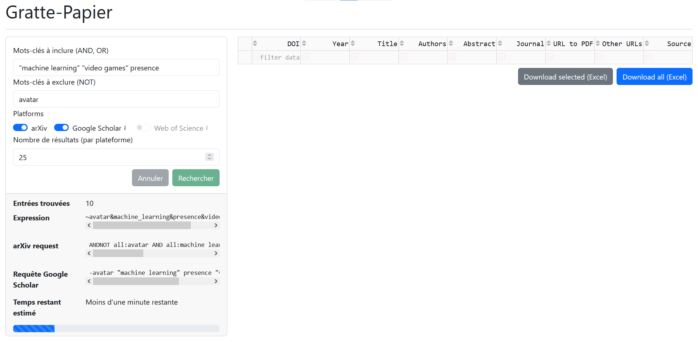

# Gratte-Papier

Paper scrapper to gather metadata.

<!-- TOC start (generated with https://github.com/derlin/bitdowntoc) -->

- [Introduction](#introduction)
- [Screenshots](#screenshots)
- [Setup](#setup)
- [Usage](#usage)
- [Contributing](#contributing)
- [Contact](#contact)

<!-- TOC end -->

## Introduction

Gratte-Papier basically means Paper Scrapper in French.

Graphical interface for retrieving metadata from scientific papers. Enables the preparation of scoping reviews, systematic literature reviews and meta-analyses.

## Screenshots

## Setup

This project requires Python 3.9+.

> Note: Please read the [Contributing](#contributing) part!

1. Clone that repository and cd into it: `git clone git@github.com:Amustache/Gratte-Papier.git; cd Gratte-Papier/`
2. (If not done already) Create a virtual environment: `python -m venv ./env`
3. (If not done already) Activate that virtual environment: `source ./env/bin/activate`
4. Install what is needed: `pip install -r requirements.txt`
5. Remember that you probably have a cup of tea or coffee getting cold.

> Note: One of the dependencies, namely `scholarly`, might use Selenium for antispam purposes. This should not be the case here, as we are querying slowly; however, if it happens to be the case, you need to have a CLI firefox available.
> 
> Debian: https://www.linuxcapable.com/how-to-install-firefox-on-debian-linux/.

> Note: If you want to use Web of Science, you need to create a `config.py` file with the corresponding API key. A template is available: [`config.py.dist`](./config.py.dist).
> 
> More information: https://developer.clarivate.com/apis/wos.

## Usage

1. (If not done already) Go into the root folder
2. (If not done already) Activate the virtual environment: `source ./env/bin/activate`
3. Start the project: `python main.py`

Then, follow the link to access the web interface.

## Contributing

First of all, thank you for taking the time to help this project, it means a lot.

Please read our [CONTRIBUTING](CONTRIBUTING.md) file, which contains guidelines, information on what you can do to help the project, and good practices to apply.

To sum-up:
* You know how to Python? You can help the project by [reviewing code](https://github.com/AMustache/Gratte-Papier/pulls), [fixing bugs](https://github.com/AMustache/Gratte-Papier/issues), and [adding features](https://github.com/AMustache/Gratte-Papier/issues)!
* You know how to data analysis? You can help the project by [providing insights about data sources](https://github.com/AMustache/Gratte-Papier/wiki)!
* No matter what you know, you can always report a bug or [ask for a feature](https://github.com/AMustache/Gratte-Papier/issues), [discuss about the project](https://github.com/AMustache/Gratte-Papier/discussions), or [get in touch](mailto:stache@stache.cat)!

## Contact

For any question regarding the project, please contact [me](mailto:stache@stache.cat).
